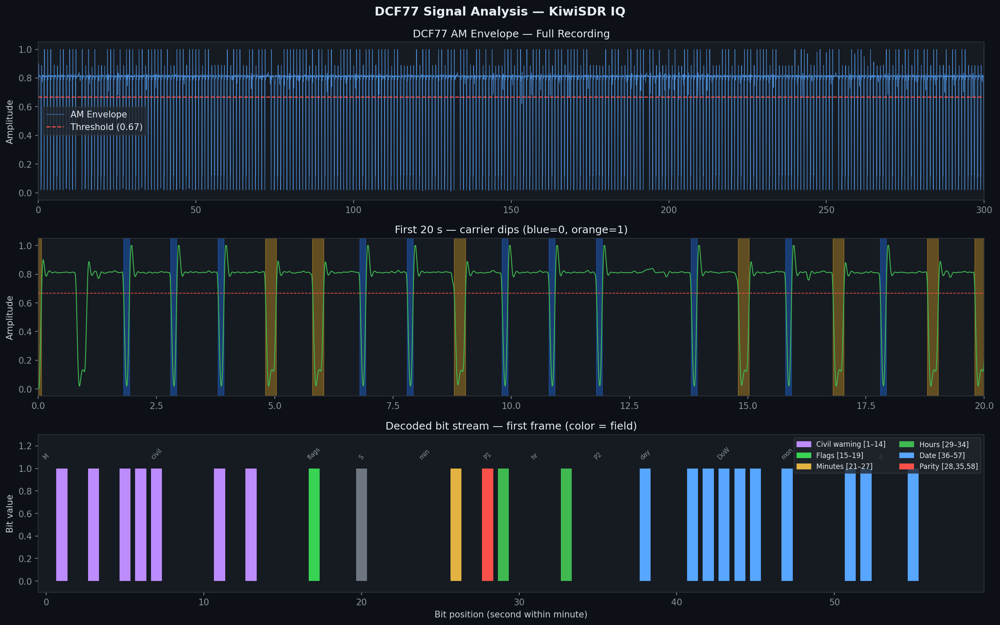

# DCF77 Live Decoder — KiwiSDR IQ Edition

> Receive, decode and analyse the DCF77 atomic time signal live from the internet using a public KiwiSDR receiver and pure Python — no radio hardware required.

---

## What This Is

DCF77 is a German longwave time signal broadcast at **77.5 kHz** from Mainflingen, Germany at 50 kW. It has been transmitting continuous date and time information since 1973, synchronising clocks across Europe.

This project connects to a public **KiwiSDR** software-defined radio receiver over the internet, streams raw **IQ (In-phase/Quadrature)** samples at 77.5 kHz, computes the true AM amplitude envelope, and decodes the full 59-bit DCF77 telegram — including date, time, timezone, parity checks, and all control flags — entirely in Python.

```
KiwiSDR receiver          IQ stream            Python decoder
db0whm.hamnet.network  →  stereo WAV  →  sqrt(I²+Q²)  →  59-bit DCF77 frame
(49.57°N, 8.62°E)         77.5 kHz              OOK pulse detection
~35 km from transmitter    --mode iq             BCD decode + parity
```

---

## Signal Analysis Output



Three-panel analysis plot:
- **Top** — full 300s IQ amplitude envelope with adaptive threshold
- **Middle** — first 20s zoomed showing clean 1-second carrier dips (blue=bit 0, orange=bit 1)
- **Bottom** — decoded 59-bit frame coloured by field (civil warning, flags, minutes, hours, date, parity)

---

## Decoded Output Example

```
╔══════════════════════════════════════════════════════════════╗
║           DCF77 Live Decoder — KiwiSDR IQ Edition          ║
║   77.5 kHz · Mainflingen, Germany · Pure Python            ║
╚══════════════════════════════════════════════════════════════╝

  FRAME #1  |  59 bits  |  ✅ VALID
══════════════════════════════════════════════════════════════
  📅  Sunday, 24/05/2026
  🕐  11:20  (CEST UTC+2)
  🌍  UTC: 09:20
  ☀️   Summer time (CEST) is active

  Field breakdown:
    [0]       start      = 0  (must be 0)
    [17]      CEST       = 1  (summer time UTC+2)
    [20]      time start = 1  (must be 1)
    [21–27]   minutes    = 0000010  → 20
    [28]      P1         = 1  ✅
    [29–34]   hours      = 100010  → 11
    [35]      P2         = 0  ✅
    [36–41]   day        = 001001  → 24
    [42–44]   weekday    = 111  → Sunday
    [45–49]   month      = 10100  → 05
    [50–57]   year       = 01100100  → 2026
    [58]      P3         = 0  ✅
```

---

## Why IQ Mode?

Getting a clean DCF77 decode from a KiwiSDR required solving a non-obvious problem:

| Mode | Problem |
|------|---------|
| `cwn` | Filter ringing creates fake ~200ms pulses — all bits decoded as 1 |
| `am` | Demodulator beat frequency produces 70ms/125ms artefacts |
| `usb/lsb` | Filter spreading makes 100ms and 200ms pulses indistinguishable |
| **`iq`** ✅ | Raw complex samples — `sqrt(I²+Q²)` gives the true amplitude envelope |

IQ mode delivers the raw baseband signal. Computing `sqrt(I²+Q²)` gives the instantaneous carrier amplitude directly, making the 100ms (bit 0) and 200ms (bit 1) OOK dips clearly separable.

---

## Requirements

### System
```bash
sudo apt install libsamplerate0   # Ubuntu/Debian
```

### Python
```bash
pip install numpy scipy matplotlib
```

### kiwiclient
```bash
git clone https://github.com/jks-prv/kiwiclient
```

---

## Usage

### Step 1 — Record IQ from KiwiSDR

```bash
python ./kiwiclient/kiwirecorder.py \
  --server-host db0whm.hamnet.network \
  --server-port 8073 \
  --freq 77.5 \
  --mode iq \
  --tlimit 300 \
  --filename dcf77_live \
  --log-level warn
```

This records 5 minutes of IQ data as a stereo WAV file (`dcf77_live.wav`). The server `db0whm.hamnet.network` is located at 49.57°N, 8.62°E — approximately 35 km from the DCF77 transmitter, giving excellent signal strength (~-65 dBm).

### Step 2 — Decode and Analyse

```bash
python dcf77_websdr.py --file dcf77_live.wav --plot --verbose
```

### Options

| Flag | Description |
|------|-------------|
| `--file` | IQ or mono WAV file to decode |
| `--plot` | Save matplotlib signal analysis plot as `dcf77_analysis.png` |
| `--verbose` | Print every detected pulse and full bit-field breakdown |

---

## How It Works

### Signal Pipeline

```
IQ stereo WAV (I=left, Q=right)
         │
         ▼
  amplitude = sqrt(I² + Q²)
         │
         ▼
  Butterworth LPF (120ms smoothing)
  → normalise to [0, 1]
         │
         ▼
  1-second window pulse detector
  → find deepest dip per second
  → measure duration below threshold
         │
         ▼
  Bit classification
  ~125ms → bit 0
  ~231ms → bit 1
  gap >1.8s → minute marker
         │
         ▼
  Frame extraction (59 bits per minute)
  + auto-alignment (scan for bit0=0, bit20=1)
         │
         ▼
  DCF77 telegram decode
  BCD minutes [21–27] + P1 [28]
  BCD hours   [29–34] + P2 [35]
  BCD date    [36–57] + P3 [58]
```

### DCF77 Bit Layout

```
Bit  0     : Start of minute (always 0)
Bits 1–14  : Encrypted weather / civil warning data
Bit  15    : Call bit (abnormal transmitter operation)
Bit  16    : DST change announcement
Bit  17    : CEST active (1 = UTC+2)
Bit  18    : CET  active (1 = UTC+1)
Bit  19    : Leap second announcement
Bit  20    : Start of time encoding (always 1)
Bits 21–27 : Minutes, BCD LSB-first
Bit  28    : P1 — even parity over bits 21–27
Bits 29–34 : Hours, BCD LSB-first
Bit  35    : P2 — even parity over bits 29–34
Bits 36–41 : Day of month, BCD LSB-first
Bits 42–44 : Day of week (1=Mon … 7=Sun)
Bits 45–49 : Month, BCD LSB-first
Bits 50–57 : Year within century, BCD LSB-first
Bit  58    : P3 — even parity over bits 36–57
[Bit 59]   : No pulse — this silence IS the minute marker
```

---

## Finding a KiwiSDR

Browse public receivers at **http://rx.linkfanel.net** and pick a European node. For DCF77 you want:

- Location: Germany, Netherlands, Belgium, or UK (within 1500 km of Frankfurt)
- RSSI better than **-90 dBm** at 77.5 kHz
- Stable block counter (no dropped frames)

Test a server before a full capture:

```bash
python ./kiwiclient/kiwirecorder.py \
  --server-host <hostname> \
  --server-port 8073 \
  --freq 77.5 \
  --mode iq \
  --tlimit 20 \
  --filename test \
  --log-level info
```

A good connection shows steady block increments and RSSI around -65 to -85 dBm.

---

## Project Structure

```
dcf77-decoder/
├── dcf77_websdr.py      # main decoder
├── generate_dcf77.py    # synthetic DCF77 WAV generator (for testing)
├── kiwiclient/          # git clone https://github.com/jks-prv/kiwiclient
├── dcf77_live.wav       # recorded IQ capture (generated on first run)
└── dcf77_analysis.png   # signal analysis plot (generated with --plot)
```

---

## References

- PTB DCF77 specification: https://www.ptb.de/cms/en/ptb/fachabteilungen/abt4/fb-44/ag-442/dissemination-of-legal-time/dcf77.html
- KiwiSDR project: https://github.com/jks-prv/kiwiclient
- Public KiwiSDR map: http://rx.linkfanel.net
- DCF77 Wikipedia: https://en.wikipedia.org/wiki/DCF77

---

## License

GNU General Public License v3.0 (GPL-3.0) — free to use, modify and distribute with attribution.